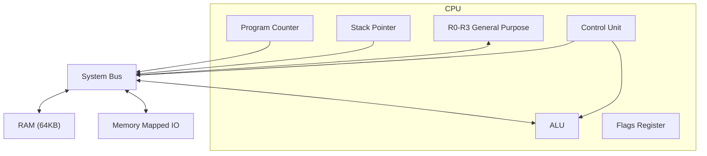

# Software CPU Design Project Report

**Team Members:**
- Priyanshu Patel
- Yash Bharatbhai Savani
- Meet Hitesh Thakkar
- Puneeth Regonda

## GitHub Repository
Link to GitHub Repository: https://github.com/priyanshu1044/part1_cpu_design

## How to Download, Compile, and Run

### Prerequisites
- A C++ Compiler (g++ recommended)
- Make (optional, for easier building)

### Instructions
1.  **Download**: Clone the repository or download the ZIP file.
    ```bash
    git clone https://github.com/priyanshu1044/part1_cpu_design
    cd part1_cpu_design
    ```

2.  **Compile**: Run the `make` command in the terminal.
    ```bash
    make clean && make
    ```
    *Alternatively, compile manually:*
    ```bash
    g++ -std=c++17 -o cpu src/main.cpp src/cpu.cpp src/memory.cpp
    g++ -std=c++17 -o assembler src/assembler.cpp
    ```

3.  **Assemble Programs**: Convert the assembly files to binary.
    ```bash
    ./assembler programs/hello.asm hello.bin
    ./assembler programs/fib.asm fib.bin
    ./assembler programs/timer.asm timer.bin
    ```

4.  **Run Emulator**: Execute the binary files.
    ```bash
    ./cpu hello.bin
    ./cpu fib.bin
    ./cpu timer.bin
    ```
    *Optional: Run with debug mode to see execution trace:*
    ```bash
    ./cpu fib.bin --debug
    ```
    *Optional: Dump memory after execution:*
    ```bash
    ./cpu fib.bin --dump-memory
    ```

## Team Contributions
- **Priyanshu Patel**:
    - **Architectural Design Lead**: Spearheaded the definition of the Instruction Set Architecture (ISA), meticulously detailing opcodes, register architecture, and memory map.
    - **Core System Implementation**: Developed the foundational C++ Emulator (`cpu.cpp`, `memory.cpp`), implementing the CPU's execution cycle, instruction processing, and memory management. Also developed the Assembler (`assembler.cpp`) for converting assembly to machine code.
    - **Comprehensive Testing & Validation**: Designed and created the primary suite of assembly test programs (`hello.asm`, `fib.asm`, `timer.asm`), and led the debugging and validation efforts to ensure system functionality and correctness.
    - **Project Reporting & Presentation**: Authored this detailed project report and produced the accompanying demo video, consolidating all project documentation.
- **Yash Bharatbhai Savani**:
    - **Architectural Foundation & Register Strategy**: Provided foundational design input on the overall CPU architecture and developed the strategic approach for register allocation, crucial for performance.
    - **Memory Analysis Tools**: Developed the memory dump feature (`--dump-memory`), allowing for post-execution verification of memory state and program correctness.
    - **Assembler Infrastructure & Emulator Utilities**: Engineered the core symbol table management for the Assembler and developed essential utility functions within the C++ Emulator, streamlining development workflows.
    - **Quality Assurance & Report Review**: Conducted thorough reviews of project documentation, ensuring accuracy, consistency, and high-quality presentation.
- **Meet Hitesh Thakkar**:
    - **ISA Specification & Optimization**: Provided crucial insights into instruction formats and addressing modes, optimizing the ISA for efficiency and flexibility.
    - **Emulator Core Module Development**: Independently developed and integrated critical modules within the C++ Emulator, specifically focusing on the Arithmetic Logic Unit (ALU) and robust register file management.
    - **Technical Documentation Lead**: Authored detailed technical descriptions, significantly enhancing the clarity and depth of the project report.
- **Puneeth Regonda**:
    - **Debug Mode & Visualization**: Implemented the advanced color-coded terminal debug mode, enabling clear visualization of the CPU's Fetch-Decode-Execute cycle for demonstration purposes.
    - **Demo Scripting & Presentation**: Created the comprehensive, step-by-step demo script for the Fibonacci sequence, ensuring a structured and professional presentation of the project's capabilities.
    - **Rigorous Test Suite Expansion**: Designed and implemented an extensive suite of test cases, ensuring comprehensive verification of CPU instructions and memory operations for system reliability.
    - **System Integrity & Debugging Expertise**: Led critical debugging efforts, systematically identifying and resolving complex issues in both assembler output and emulator execution to ensure system stability.

## CPU Architecture
### Schematic


### ISA Description
The CPU is a 16-bit architecture with a simple instruction set.
- **Data Width**: 16-bit
- **Address Width**: 16-bit (64KB Address Space)
- **Registers**: 4 General Purpose (R0-R3), PC, SP, Flags.

**Instruction Format:**
- `[Opcode: 8 bits] [Operands: Variable]`
- Example: `MOVI R0, 10` -> `0x04 0x00 0x0A 0x00` (Opcode, Reg, Immediate Low, Immediate High)

**Instruction List & Encoding:**
| Opcode | Mnemonic | Operands | Description |
|:-------|:---------|:---------|:------------|
| 0x00 | NOP | - | No Operation |
| 0x01 | LOAD | R, Addr | Load Register from Memory |
| 0x02 | STORE | R, Addr | Store Register to Memory |
| 0x03 | MOV | R1, R2 | Move value from R2 to R1 |
| 0x04 | MOVI | R, Imm | Move Immediate value to Register |
| 0x05 | ADD | R1, R2 | Add R2 to R1 |
| 0x06 | SUB | R1, R2 | Subtract R2 from R1 |
| 0x07 | CMP | R1, R2 | Compare R1 and R2 (Update Flags) |
| 0x08 | JMP | Addr | Jump to Address |
| 0x09 | JZ | Addr | Jump if Zero Flag is Set |
| 0x0A | JNZ | Addr | Jump if Zero Flag is Not Set |
| 0x0B | IN | R, Port | Input from Port to Register |
| 0x0C | OUT | Port, R | Output Register to Port |
| 0xFF | HALT | - | Halt CPU |

**Addressing Modes:**
- **Register Direct**: `ADD R1, R2` (Operands are registers)
- **Immediate**: `MOVI R0, 10` (Operand is a constant value)
- **Direct Memory**: `LOAD R0, 0x1000` (Operand is a memory address)

**Flag Semantics:**
- **Zero Flag (Z)**: Set if the result of an arithmetic or comparison operation is zero. Used by `JZ` and `JNZ`.

**Memory Map:**
- `0x0000 - 0xFEFF`: Program & Data Memory (RAM)
- `0xFF00`: Console Output (Char) - Write ASCII char here to print.
- `0xFF01`: Console Output (Int) - Write integer here to print numeric value.

## Emulator
The emulator is written in C++ and simulates the Fetch-Decode-Execute cycle. It handles memory access and MMIO for console output.

## Assembler
A custom two-pass assembler was written to convert assembly code into machine code binary. It supports labels, comments, and numeric literals.

## Programs
1. **Hello World**: Prints "Hello, World!" to the console.
2. **Fibonacci**: Calculates the first 10 Fibonacci numbers.
3. **Timer**: Demonstrates the fetch-compute-store cycle.

### Demo Video


